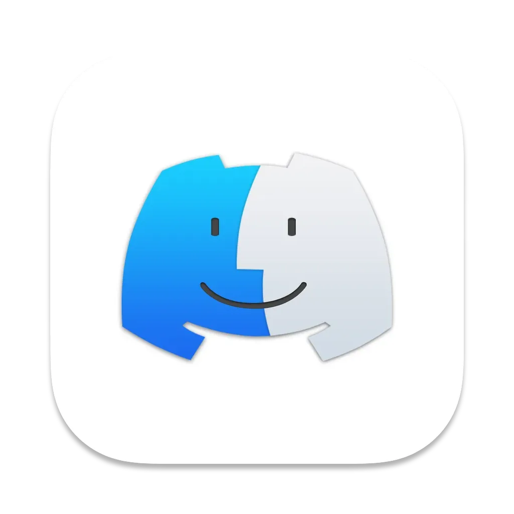

  <picture>
    
  </picture>

  Macaccord - A SwiftUI Recreation of Discord

   

# Macaccord
Ever just hate how Electron eats your RAM? Same! This is a WIP project to recreate Discord in Swift with native intergrations for minimum bloat

Currently working on the general messaging experience, voice chat and streaming will be researched later if possible.
